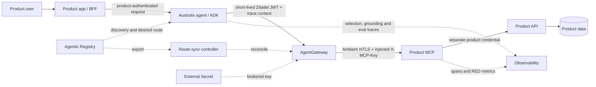
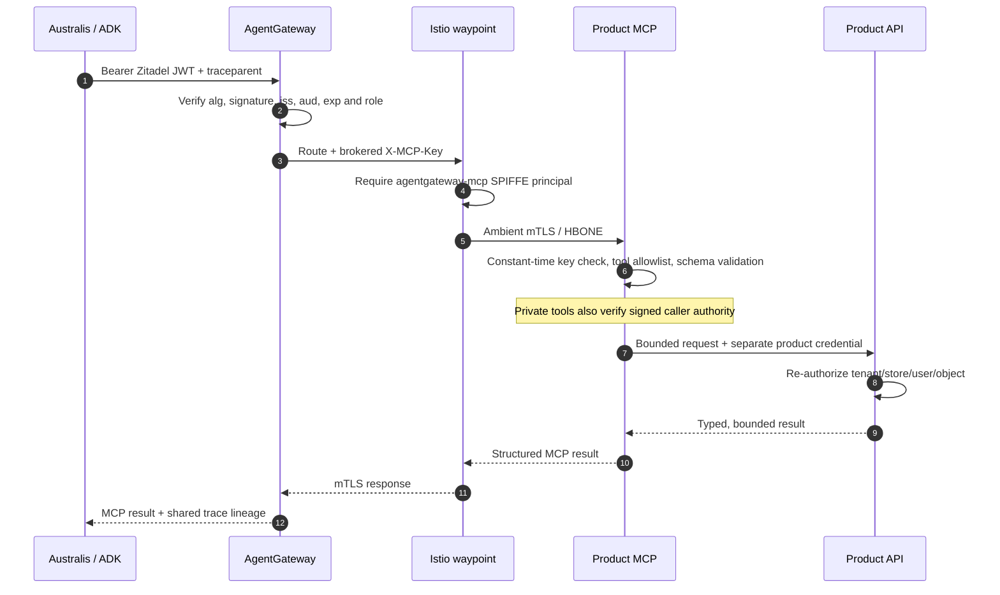
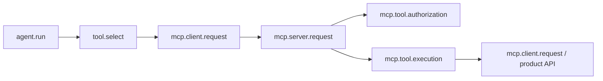

# Guide — onboard a product-owned MCP connector

This is the reusable path for Kora, Mark8ly, HomeChef, HMS, and future product
teams. It covers the service, Registry, AgentGateway, Ambient mesh, Australis
ADK consumer, tests, evaluation, observability, rollout, and retirement.

The governing decision is
[ADR-0004: Product-owned MCP connectors](../adr/0004-product-owned-mcp-connectors.md).
The editable architecture is
[`product-mcp-lifecycle.drawio`](../diagrams/product-mcp-lifecycle.drawio).

## The short version



The Registry is control plane, not request path. AgentGateway authenticates the
agent and brokers a connector credential. The connector re-authorizes the tool
and calls the product API with a different credential. The product API remains
the final authority for every tenant, user, storefront, and object.

## Mark8ly decision summary

| Question | Direction |
| --- | --- |
| Product-owned service and image? | Yes. Keep the merged connector in Mark8ly; do not add it to the shared support-platform executable. |
| Server name | `mark8ly-catalog-mcp`, distinct from legacy `mark8ly-mcp`. |
| Gateway key | `MARK8LY_CATALOG_MCP_KEY` from `prod-mark8ly-mcp-catalog-key`. |
| Registry route requirements | Internal record, `class: platform`, protocol `2026-07-28`, remote URL, tenant label, and `credentialRef`; not a directory record. |
| Mesh policy | Dedicated ServiceAccount, strict mTLS, workload and Service-targeted ALLOW/DENY, and narrow NetworkPolicy. A waypoint alone is insufficient. |
| JWT granularity | `agentgateway.mcp` is enforced today. Provision `mcp:mark8ly:mark8ly-catalog-mcp` before per-server enforcement is enabled. |
| `MIN_RESOURCES` | Do not bump for a connector; it protects the permanent platform baseline. |
| First caller | Mark8ly's Australis tenant through ADK. No production activation without that consumer owner and HTTP eval. |
| Kargo | Independent Warehouse/freight subscription; never join the seven-image synchronized tag set. |

## What to copy from Kora—and what not to copy

Kora is the production reference for the platform journey:

- its Registry seed identifies tenant, protocol, internal endpoint and gateway
  credential reference;
- route-sync creates a tenant-qualified route;
- AgentGateway authenticates the caller and injects a product-specific MCP key;
- the namespace is Ambient-enrolled and bound to a waypoint;
- `kora-mcp` has a dedicated ServiceAccount/SPIFFE identity, strict mTLS, and
  explicit workload plus Service-targeted authorization; and
- a stateless `tools/list` plus harmless read-only `tools/call` verifies the
  real Gateway → MCP → product API path.

Do not copy Kora's shared `slm-support-platform/mcp-gateway` image. That is a
legacy packaging choice that couples several tenants to one executable release.
Copy its identity, route, credential, policy, probe, and observability pattern
into the product-owned workload instead.

## 1. Choose a bounded server

Name one product domain, not the whole product:

- `mark8ly-catalog-mcp`, not a second `mark8ly-mcp`;
- `kora-nutrition-mcp`, not `kora-everything`; and
- separate read and future write domains when their roles or risk differ.

The product repository owns source, image, deployment, and API contract tests.
Australis owns only the consumer configuration and quality evidence. A
centrally owned connector may live in this repository when Australis also owns
its data and release lifecycle.

Kora's current shared `mcp-gateway` is the production topology reference for
Registry routing, brokered credentials, SPIFFE authorization, and stateless
protocol probes. It is a legacy packaging reference, not the template for a new
shared executable.

### Where each piece of code and configuration lives

Keep the executable next to the product API contract and keep platform desired
state in the repository that owns that control plane:

| Artifact | Repository | Recommended path |
| --- | --- | --- |
| Mark8ly connector executable | `mark8ly` | `services/mcp/cmd/mcp-catalog/` |
| Mark8ly connector domain/client code | `mark8ly` | `services/mcp/internal/catalog/` |
| Mark8ly connector config/server adapters | `mark8ly` | `services/mcp/internal/config/` and `services/mcp/internal/server/` |
| Connector module, image and tests | `mark8ly` | `services/mcp/go.mod`, `services/mcp/Dockerfile`, adjacent `_test.go` files |
| Kubernetes workload and Argo application | `tesserix-k8s` | a dedicated `charts/apps/mark8ly-catalog-mcp/` plus `argocd/prod/apps/ai-apps/` entry |
| Ambient/waypoint and namespace-owned NetworkPolicy | `tesserix-k8s` | product chart first; centralized `istio-config` only where it already owns the policy |
| External Secret mapping | `tesserix-k8s` | `external-secrets/prod/agentgateway-system/` and the product namespace |
| Registry seed | `devai` | `architecture/registry-seeds/mcp-servers/mark8ly-catalog-mcp.yaml` |
| Australis/ADK consumer pin and eval set | `australis` | tenant configuration/evaluation area when the Mark8ly consumer is implemented |
| Shared protocol/runtime libraries | `go-shared` or `tesserix-mcp-runtime` | versioned library repository; never copied into the product |

The merged Mark8ly layout is already in the right ownership boundary. Do not
move it into `slm-support-platform` or `australis/servers/`. If Mark8ly later
adds a connector with a different credential, dependency set, or release
cadence, give that connector its own module/image rather than adding it to the
catalog process.

For a new Go product with one connector, the same shape is reusable:

```text
services/mcp/
├── cmd/<product-domain-mcp>/main.go
├── internal/<domain>/          # typed product API client + projections
├── internal/config/            # bounded environment configuration
├── internal/server/            # auth and MCP transport composition
├── Dockerfile                  # one final binary
├── go.mod
└── *_test.go
```

For Python, use one independently locked service directory such as
`services/<product-domain-mcp>/` with its own `pyproject.toml`, `uv.lock`,
Dockerfile, source, contract fixtures, and tests.

## 2. Select runtime and ADK responsibilities

### MCP server

Use the implementation native to the product:

- Go services may use the reviewed `go-shared/mcp` package;
- Python services should use the exact published `tesserix-mcp-runtime` wheel;
  and
- another implementation must pass the same external conformance, security,
  protocol, and evaluation gates.

The runtime currently ships as release candidate `v0.1.0-rc.6`, not on PyPI.
Install its immutable wheel with uv:

```bash
uv venv
uv pip install --python .venv/bin/python \
  https://github.com/tesserix/tesserix-mcp-runtime/releases/download/v0.1.0-rc.6/tesserix_mcp_runtime-0.1.0rc6-py3-none-any.whl
.venv/bin/python -c "import tesserix_mcp_runtime"
```

Pin and verify the release checksum and attestation in CI. Do not replace this
with an unpinned VCS dependency or a guessed PyPI version.

### ADK consumer

ADK normally belongs on the **agent side**, not inside the connector. The
Australis agent resolves the reviewed Registry record, exposes only the pinned
tool surface to the model, and calls the tenant-scoped AgentGateway URL.

Use `ADKStreamableHTTPBridge` only when a server is deliberately exporting an
existing in-process `AgentToolView`. That optional bridge is pinned to
`tesserix-adk==0.53.1`. A normal Go catalog connector does not need the ADK or a
model provider in its image.

The separation matters:

| Layer | Decides |
| --- | --- |
| ADK/Australis | which reviewed tool is useful for this turn |
| AgentGateway | whether this JWT may enter the gateway and which backend receives it |
| MCP runtime | whether this gateway may invoke this allowlisted tool with valid arguments; private data additionally requires signed caller authority |
| Product API | whether the principal may read this tenant/user/object |

Semantic relevance never grants authority.

### Authentication is not authorization

Each control answers one question and must not substitute for the next one:

| Boundary | Authentication evidence | Authorization decision | Owner |
| --- | --- | --- | --- |
| Product app to Australis/ADK | product session or approved machine identity | may this caller start this agent/tenant run? | product and Australis |
| Australis/ADK to AgentGateway | short-lived Zitadel JWT with fixed issuer, audience, expiry and role | may this agent enter MCP and, when enabled, reach this server? | Agentic Platform |
| AgentGateway to product MCP | Ambient mTLS SPIFFE identity plus brokered `X-MCP-Key` | may this workload invoke this server and exact allowlisted tool? | mesh policy plus MCP runtime |
| Product MCP to product API | separate product workload credential | may this principal read this tenant, user, store and object? | product API |

The Zitadel token is presented on every stateless request; there is no
long-lived gateway session. The current gateway role is `agentgateway.mcp`.
The target least-privilege role is `mcp:<tenant>:<server>`, provisioned before
`requireServerScope` is enabled. Workload SPIFFE identity says *which pod* is
calling; it never establishes the end user's identity.

There are two supported authorization profiles:

| Profile | Suitable for | Required checks |
| --- | --- | --- |
| Service-authorized public read | Mark8ly's current public storefront catalog; Kora's reviewed shared nutrition lookup | Gateway JWT/role, SPIFFE principal, server-specific MCP key, exact tool allowlist, closed arguments, product service key |
| Caller-authorized private read | orders, conversations, user logs, merchant-only data | everything above **plus** connector verification of signed caller tenant/subject/scopes and product API object-level authorization |

Never treat `store_slug`, `tenant_id`, `user_id`, `X-Tenant-Id`, or another
plain header as proof of authority. It may locate a resource only after a
cryptographically verified identity grants access to it.

## 3. Author a safe tool surface

Every first-release tool must be read-only. Define closed, bounded input and
output schemas. Identity fields such as `tenant_id`, `user_id`, `subject`, and
roles are not model arguments; when a tool needs identity, derive it from
verified signed call context.

For every tool:

- declare one specific read scope where the runtime supports tool scopes, and
  at minimum provision the server-specific gateway scope;
- cap strings, arrays, pages, request bytes, response bytes, and deadlines;
- use cursor pagination where a list can grow;
- return typed structured content with a stable source locator for citations;
- parameterize every query and scope it by the verified product identity;
- return stable error codes without upstream bodies or stack traces; and
- declare the downstream host and use a bounded client timeout.

For a public catalog, the store slug is a locator and may be a tool argument.
It is not an authorization boundary. Do not add private product, merchant,
customer, order, or inventory fields until the caller-authorized profile is
implemented end to end.

The Mark8ly catalog's five storefront tools are a suitable bounded domain. Its
MCP server credential and its `X-Storefront-Key` are separate credentials for
separate trust crossings.

## 4. Package one independent workload

The connector receives its own:

- immutable image and digest;
- Kubernetes Deployment and ClusterIP Service;
- ServiceAccount named after the server;
- `automountServiceAccountToken: false`;
- startup, liveness, readiness, and metrics paths;
- memory request/limit and an evidence-based CPU request;
- graceful SIGTERM drain longer than the maximum admitted call; and
- dashboard, alerts, owner, runbook, and one-action rollback.

Start with one replica while the feature is optional. Move to two replicas,
topology spread, and a PodDisruptionBudget before making it user-critical.
Stateless MCP revision `2026-07-28` must reject `Mcp-Session-Id`, so replicas do
not require affinity.

Do not add a connector to a multi-image Kargo Warehouse that requires unrelated
services to share a tag. Use an independent Warehouse/freight subscription and
promotion step. A connector release must not stall the rest of a product.

## 5. Add secrets without crossing boundaries

For `mark8ly-catalog-mcp`, use:

```text
Secret Manager:  prod-mark8ly-mcp-catalog-key
Kubernetes:      agentgateway-system/product-mcp-upstream-keys
Secret key:      MARK8LY_CATALOG_MCP_KEY
Injected header: X-MCP-Key
```

The connector-to-product-API credential remains in the product namespace, for
example:

```text
Secret Manager:  prod-mark8ly-storefront-key
Kubernetes:      mark8ly/mark8ly-marketplace-api-storefront-key
Container key:   STOREFRONT_KEY
Outbound header: X-Storefront-Key
```

Never place either value in Registry YAML, Helm values, logs, traces, eval
fixtures, screenshots, or tool results. Rotation must not require rebuilding
the image. Do not reuse legacy `MARK8LY_MCP_KEY`; it identifies a different
server and contract.

### Authentication sequence



Expected failures are deliberate: no or invalid JWT is rejected at
AgentGateway; the wrong SPIFFE principal is rejected by Istio; a missing or
wrong MCP key is rejected before MCP parsing; and an unauthorized private
object is rejected by the product API without disclosing whether it exists.

## 6. Enrol and authorize the mesh

The namespace must carry:

```yaml
istio-injection: disabled
istio.io/dataplane-mode: ambient
istio.io/use-waypoint: waypoint
```

The server chart must render:

1. a dedicated ServiceAccount;
2. workload-scoped `PeerAuthentication` with `STRICT` mTLS;
3. direct-workload ALLOW and DENY policies;
4. Service-targeted waypoint ALLOW and DENY policies; and
5. the narrow Kubernetes NetworkPolicy paths required by AgentGateway/HBONE
   and the backing API.

Allow the exact caller principal:

```text
cluster.local/ns/agentgateway-system/sa/agentgateway-mcp
```

A waypoint alone allows nothing. A namespace-wide source grant is not a
replacement for the Service-targeted rule, because it broadens unrelated
workloads. If the namespace's NetworkPolicy is owned by centralized
`istio-config`, add the narrow entry there; otherwise keep it in the
product-owned chart. One resource must have one field manager.

The request crosses the mesh as follows:

1. AgentGateway selects the Registry-derived backend and sends the request.
2. Its local ztunnel establishes HBONE and mutual TLS using the
   `agentgateway-mcp` ServiceAccount identity.
3. The destination waypoint evaluates the Service-targeted L7 policy against
   the original AgentGateway principal, method, and MCP path.
4. The destination ztunnel delivers only admitted traffic to the connector.
5. A workload-targeted policy also protects attempts that bypass the Service
   or waypoint path.

Do not authorize by pod IP, node CIDR, namespace name alone, or the presence of
an injected header. Keep liveness/readiness access explicit and narrow; do not
open the MCP path merely to make probes pass. Validate rendered policies in a
staging namespace because Istio `targetRefs` behavior depends on the installed
control-plane version.

## 7. Seed the Registry

Use a unique record, for example:

```yaml
apiVersion: registry.agentic.dev/v1alpha1
kind: MCPServer
metadata:
  name: mark8ly-catalog-mcp
  namespace: devai
  visibility: internal
  labels:
    devai.io/source: mark8ly
    devai.io/category: product-catalog
    mcp.tesserix.app/tenant: mark8ly
    mcp.tesserix.app/class: platform
spec:
  name: mark8ly-catalog-mcp
  displayName: Mark8ly Catalog MCP
  description: Read-only storefront catalog tools for Mark8ly agents.
  endpoint: http://mark8ly-catalog-mcp.mark8ly.svc.cluster.local:8765/mcp
  protocolVersion: "2026-07-28"
  remotes:
    - type: streamableHttp
      url: http://mark8ly-catalog-mcp.mark8ly.svc.cluster.local:8765/mcp
  authMode: apikey
  credentialRef:
    secretName: product-mcp-upstream-keys
    key: MARK8LY_CATALOG_MCP_KEY
    header: X-MCP-Key
  tools:
    - get_store_branding
    - list_store_categories
    - list_products_by_category
    - list_store_products
    - get_store_product
```

The route-sync controller requires `class: platform`, protocol
`2026-07-28`, a remote URL, and a non-directory record. `visibility: internal`
is correct and must remain readable to its Registry identity. `authMode` is
descriptive; `credentialRef` is what creates the backend credential policy.

Merge the seed under `devai/architecture/registry-seeds/mcp-servers/`, then
bump the reviewed `reseedNonce` in the bootstrap chart. Verify the bootstrap
Job completed and exact-fetch the record before looking for a gateway route.
Publication and activation are separate states.

## 8. Understand route reconciliation

Every 30 seconds, route-sync obtains a complete `/v0/export/agentgateway`
snapshot, verifies it, and reconciles these resources in
`agentgateway-system`:

- `AgentgatewayBackend` named `<tenant>-<server>`;
- `HTTPRoute` at `/mcp/<tenant>/<server>`;
- an upstream credential `AgentgatewayPolicy` when `credentialRef` exists; and
- a per-server JWT policy when `requireServerScope` is enabled.

The current coarse role is `agentgateway.mcp`. Per-server roles are supported
as `mcp:<tenant>:<server>`, but enforcement is currently disabled. Provision
all intended callers before enabling it globally.

`MIN_RESOURCES=27` protects the permanent platform baseline against a
catastrophic partial export. Do not bump it for each connector. If it trips,
the controller must retain last-known-good state. Restore the export; do not
lower the floor to make pruning proceed.

## 9. Configure the first consumer

Production needs a named consumer. The default first consumer is the product's
Australis tenant through ADK. Pin the exact Registry revision, registry digest,
artifact/image digest, tool names, schema fingerprints, deadline, and maximum
calls per turn. Never resolve `latest` during a request.

The model sees only the allowlisted tool descriptions. The ADK sends its
short-lived Zitadel JWT and W3C trace context to AgentGateway. It never receives
the MCP key or product API key.

If there is no consumer yet:

- deploy and test in staging;
- keep the Registry record internal and set `gatewayExport: false`;
- do not add the production Kargo subscription; and
- open a consumer-onboarding issue with an owner and acceptance eval.

## 10. Test the complete lifecycle

### Gate A — local behavior

- Unit-test each tool's real public contract.
- Test empty, maximum, malformed, and pagination boundaries.
- Test two subjects in one tenant cannot see each other's objects.
- Test another tenant receives the non-disclosing denial shape.
- Test downstream timeout, malformed response, and unavailable dependency.
- Verify every schema is closed and contains no caller-controlled identity.

### Gate B — runtime conformance and security

Use `tesserix-mcp-runtime[testkit]` as a development dependency. Run the
versioned conformance target against the real server path, not copied expected
values. Contract 1.0 covers discovery, invocation, stable failures, lifecycle,
authorization, tenancy, limits, telemetry, and cancellation. Run the 51-case
adversarial security contract before release.

For Python runtime development:

```bash
uv run --frozen pytest
uv run --frozen python benchmarks/measure_conformance.py
```

A Go server can use an external target adapter or an equivalent protocol test
lane; language choice does not waive the contract.

### Gate C — image and manifest

- Build from a digest-pinned runtime image as non-root with a read-only root
  filesystem.
- Generate SBOM and vulnerability evidence.
- Scan the diff and image for secret material.
- Pin the image digest in GitOps.
- Verify the generated Registry manifest matches the running tool schemas.

### Gate D — staging workload and mesh

- Argo application is `Synced/Healthy`.
- Deployment has expected Ready replicas and the dedicated ServiceAccount.
- Namespace is Ambient enrolled and Service is waypoint-bound.
- `PeerAuthentication` is strict.
- AgentGateway principal succeeds.
- An untrusted ServiceAccount receives 403 before the handler runs.
- Direct bypass and plaintext attempts fail.

### Gate E — Registry and gateway activation

- Exact Registry record exists with the intended tenant and revision.
- Backend, HTTPRoute, and credential policy report Accepted/ResolvedRefs.
- Route-sync remains ready and its desired count is above the safety floor.
- `tools/list` through AgentGateway returns exactly the reviewed tool set.
- One harmless `tools/call` reaches the real staging product API.
- Requests with missing/invalid JWT, wrong tenant, wrong role, or wrong MCP key
  fail closed.

The modern protocol is stateless and requires the complete request metadata on
every request:

```text
MCP-Protocol-Version: 2026-07-28
MCP-Method: tools/list | tools/call
MCP-Name: <tool>                 # tools/call only
Authorization: Bearer <Zitadel JWT>
Accept: application/json, text/event-stream
```

Never put a real token in a checked-in probe. Obtain it through the approved
credential provider and keep it only in process memory.

### Gate F — ADK and model evaluation

Run an authenticated staging agent with the production model policy and prove:

1. a catalog question selects the correct MCP tool;
2. an unrelated question does not select it;
3. tool results are grounded and cited without invented fields;
4. a denied or unavailable tool degrades safely;
5. the agent stays within call and token budgets; and
6. the agent trace and server trace share the same W3C trace lineage.

Use the runtime evaluation bundle locally and against Streamable HTTP. Record
all eight scores:

- correctness;
- schema conformance;
- secret leakage;
- tenant isolation;
- authorization denial;
- idempotency;
- latency; and
- availability.

Internal promotion requires HTTP evidence and a score of 1.0 for all blocking
metrics. An owner must review quality and a different reviewer must review
security. Bind the report to source, runtime, manifest, image, and dataset
digests so a later build cannot inherit stale evidence.

### Gate G — canary and production

- Promote one immutable image independently of other product services.
- Send only the named consumer first.
- Compare success/error ratio, p95/p99, policy refusals, saturation, and dropped
  telemetry with staging.
- Roll back automatically on user-visible error budget burn.
- Keep the previous route and image until the new revision has stable traffic.

Deployment alone is not success. The release is complete only when an intended
agent discovers, selects, invokes, grounds, and cites the tool.

## 11. Observability contract

One request should produce this trace:



The runtime owns the server-side span names and RED metrics. The ADK/Australis
side adds agent run, selection, grounding, citation, model usage, and evaluation
events. Propagate `traceparent` and `tracestate`; do not copy tenant, subject,
JWT, URL, request/response payload, prompts, or exception text into span or
metric attributes.

Server spans use only bounded fields such as server, registered tool,
operation, outcome, and destination fingerprint. Logs may include safe request
and trace identifiers. Expected outcomes include `success`, `policy_refusal`,
`tool_failure`, `timeout`, `cancellation`, `overload`, `dependency_outage`,
`invalid_input`, and `limit_exceeded`.

The dashboard must show:

- calls and errors by server/tool/outcome;
- p50, p95, and p99 duration;
- in-flight work, concurrency ceiling, and saturation;
- retries, limits, cancellation, and telemetry drops;
- agent tool-selection rate and no-tool rate;
- grounded/cited answer rate and grader scores; and
- model tokens, latency, and cost joined by trace ID, not payload.

Page on fast and slow SLO burn. Ticket on sustained saturation or dropped
telemetry. Every alert needs an owner and runbook.

## 12. Retirement

Deprecate, observe, then retire:

1. publish the replacement under a new immutable revision or new server name;
2. move one consumer pin and evaluate it;
3. move remaining consumers;
4. observe zero calls to the old revision for the agreed window;
5. disable discovery and routing; and
6. remove deployment and credentials only after the route is gone.

Do not delete a Registry record or Secret first. A stale route pointing at a
missing server is a harder incident than an idle deprecated server.

## FAQ

### Must the connector live in Australis?

No. Product-owned is the default because the product owns the backing schema
and release. Australis-owned cross-product connectors may live here. All
connectors still meet the same protocol and evaluation contract.

### Should a new connector use the shared `mcp-gateway` image?

No, unless it is a short-lived bootstrap explicitly accepting the shared
release blast radius. Kora's deployment proves the network and security path;
new domain connectors get an independent image and deployment.

### Does an MCP server run continuously?

In production, yes: it is a stateless HTTP service kept Ready behind a Service.
It does not keep a permanent connection to AgentGateway or Registry. Each call
is independent, and any replica can serve it.

### Does the Registry proxy tool calls?

No. It is the catalog and desired-state source. AgentGateway is the request
path. Existing calls continue when Registry is temporarily unavailable.

### What creates the route?

The route-sync controller exports qualified MCPServer records and reconciles
the Backend, HTTPRoute, and optional policies. The logging ConfigMap is not the
data-plane configuration source.

### Do `visibility` and `class` affect routing?

Yes, differently. Visibility controls whether route-sync can read the record.
`mcp.tesserix.app/class: platform` is an explicit route eligibility gate.
Protocol version `2026-07-28` is also mandatory.

### Does `authMode: apikey` inject the key?

No. `credentialRef` triggers the generated credential policy. It maps the
named Secret and key automatically but never creates that Secret.

### Why are there two API keys?

They authenticate different hops. `X-MCP-Key` authenticates AgentGateway to the
connector; `X-Storefront-Key` or equivalent authenticates the connector to the
product API. Compromise and rotation stay isolated.

### Is the waypoint policy enough?

No. The waypoint enforces L7 policy but grants no caller. Add dedicated
workload and Service-targeted ALLOW/DENY policies plus Kubernetes NetworkPolicy.

### Does Istio authorize the user or tenant?

No. Ambient mTLS and SPIFFE authenticate workloads, and waypoint policy decides
which workload may reach the MCP Service. User, tenant, role, and object access
come from cryptographically verified application identity and product-side
authorization. Never mint one SPIFFE identity per user or treat namespace
membership as tenant authorization.

### Does the product MCP keep a connection to the mesh or Registry?

No. The pod remains Ready as a normal stateless HTTP service. ztunnel handles
mTLS transparently for each request, the waypoint evaluates each request, and
route-sync—not the connector—watches Registry desired state.

### Is `agentgateway.mcp` enough?

It is the currently enforced coarse role. Per-server policies are supported
but disabled. Plan and provision `mcp:<tenant>:<server>` before the platform
enables them.

### Should `MIN_RESOURCES` increase for this server?

No. It is the permanent platform baseline, not the live route count. Increase
it only when that permanent baseline changes.

### Can an MCP tool accept `tenant_id` or `user_id`?

No. Those values are attacker-controlled when they arrive from model
arguments. Derive identity from verified call context and scope the product API
query again.

### When should the server use the ADK bridge?

Only when exporting an existing ADK `AgentToolView`. A normal product MCP is a
server consumed by an ADK agent and does not embed ADK.

### What is the first meaningful end-to-end test?

An authenticated staging Australis agent asks a domain question, selects one
reviewed tool, calls it through AgentGateway, receives real product data, and
returns a grounded citation while all spans share one trace.

### What if no product agent consumes it yet?

Keep it in staging with gateway export disabled. Do not couple it to production
Kargo or call the deployment complete. Name a consumer owner and acceptance
eval first.

### Can we add write tools later?

Only under a separate decision covering approvals, product-side idempotency,
audit, retries, and compensation. Read-only v1 does not silently expand into
actions.

## Pull-request checklist

- [ ] Product and bounded domain are clear in the name.
- [ ] Product team owns code, image, deployment, SLO, and rollback.
- [ ] All first-release tools are read-only and schema-closed.
- [ ] No model-controlled identity field exists.
- [ ] Cross-user and cross-tenant negative tests pass.
- [ ] Runtime conformance and adversarial security suites pass.
- [ ] Image is immutable, non-root, read-only, scanned, and digest-pinned.
- [ ] Dedicated ServiceAccount and strict Ambient policies exist.
- [ ] Gateway and product API credentials are separate and externally sourced.
- [ ] Registry record meets every route qualification rule.
- [ ] Route resources are accepted and an authenticated stateless probe passes.
- [ ] Named Australis/ADK consumer uses an exact pin and least privilege.
- [ ] Eight evaluation scores meet the target for the promotion stage.
- [ ] Traces join agent, gateway, MCP, and product API without payload leakage.
- [ ] Kargo promotion is isolated from unrelated product images.
- [ ] Canary, rollback, dashboard, alert owner, and runbook are ready.
